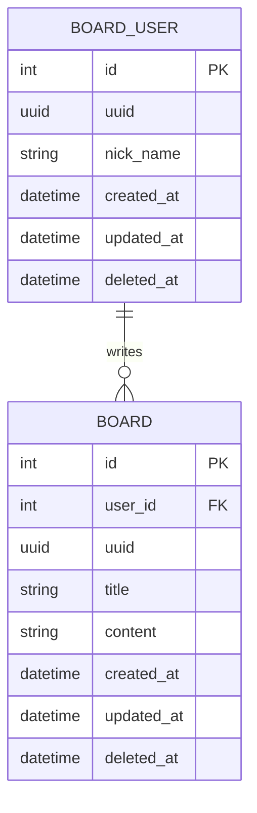

# 데이터베이스 모델 설계도

이 문서는 **SQLModel**을 사용하여 설계된 `BoardUser`와 `Board` 엔티티의 상속 구조 및 관계를 설명합니다.

## 1. 클래스 다이어그램 (UML)

아래 다이어그램은 각 클래스의 상속 계층과 필드 구성을 보여줍니다.

```mermaid
classDiagram
    %% 최상위 부모
    class SQLModel {
        <<Library>>
        (Pydantic + SQLAlchemy Core)
    }

    %% 공통 믹스인 (기능 담당)
    class TimestampModel {
        +uuid: UUID
        +created_at: datetime
        +updated_at: datetime
        +deleted_at: Optional~datetime~
    }

    %% 도메인 베이스 (데이터 담당)
    class BoardUserBase {
        +nick_name: str
    }
    class BoardBase {
        +title: str
        +content: str
    }

    %% 최종 엔티티 (실제 DB 테이블)
    class BoardUser {
        +id: int (PK)
        +boards: List~Board~ (Relationship)
    }
    class Board {
        +id: int (PK)
        +user_id: int (FK)
        +writer: BoardUser (Relationship)
    }

    %% 상속 관계 표시
    SQLModel <|-- TimestampModel
    SQLModel <|-- BoardUserBase
    SQLModel <|-- BoardBase

    %% 다중 상속
    TimestampModel <|-- BoardUser
    BoardUserBase <|-- BoardUser

    TimestampModel <|-- Board
    BoardBase <|-- Board

    %% 관계 표시
    BoardUser "1" -- "N" Board : 작성(writer)
```

## 2. 엔티티 관계도 (ERD)

실제 데이터베이스에 생성될 테이블 간의 연결 방식입니다.



## 3. 구조 요약

- **상속**: `TimestampModel`을 통해 모든 테이블에 UUID와 타임스탬프를 공통으로 적용했습니다.
- **관계**: 작성자(`BoardUser`)와 게시글(`Board`)은 **1:N** 양방향 관계로 설정되었습니다.
- **식별자**: 내부 조인용 `id(int)`와 외부 노출용 `uuid(UUID)`를 분리하여 설계했습니다.
